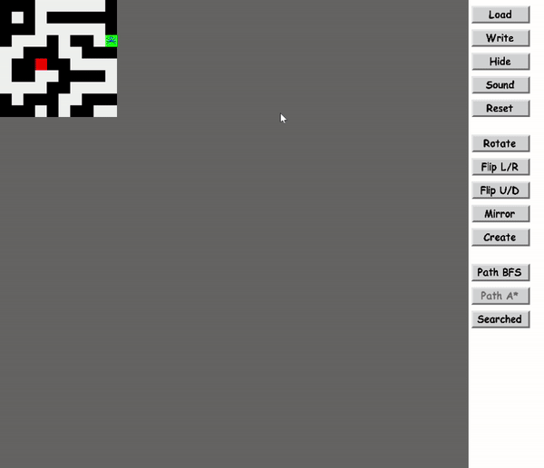
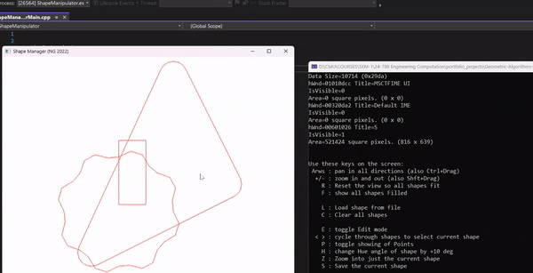

### To run these simulators open solution files in visual studio in Release x64 mode, compile and run.

The following programs are built using C++ and OpenGL.Each program has a GUI and use many fundamental Geometric and Path finding algorithms written from scratch in a modular way.
Algorithms implemented:
1. Ray Casting/Tracing.
2. BFS/DFS/ ASTAR.
3. Simple Friction and motion models
4. Searching & Sorting Algorithms.
5. geometric algortihms for estimating Shape, angle, area, position, intersection, True intersection, Tranformations etc.
## Maze Simple:
Options:

## Shape Manipulator
Options:

## Track Simulator
Options:

